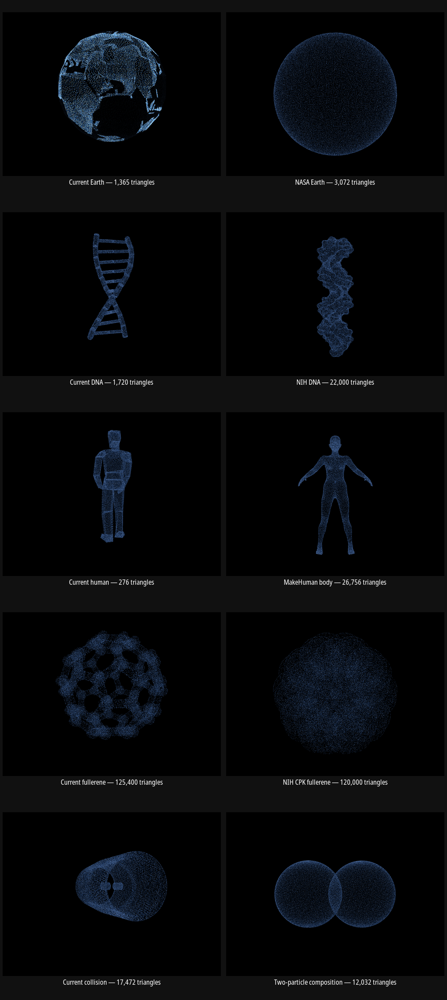

# High-detail hero model research

Research date: 2026-07-29

## Conclusion

The low-poly hypothesis is strongly supported for the human, and is plausible for
the Earth and DNA. It is not supported for the fullerene or collision stages:
those active files are already geometrically dense. A cleaner source surface is
more important than raw polygon count because the renderer ultimately reduces
every stage to 72,000 surface samples.

The best trial set is therefore:

1. Generate the Earth points directly on a mathematical sphere, using Natural
   Earth land polygons to classify continents.
2. Use the geometry-only NIH 1BNA ribbon, rotated so its helix axis is vertical.
3. Convert only the `body` group of the MakeHuman base mesh to GLB.
4. Compare the NIH space-filled C60 variant with the current ball-and-stick C60;
   do not expect more polygons to help.
5. Keep the project-authored collision spheres and consider omitting the CMS
   barrel. The denser CMS geometry is line work that cannot be surface-sampled
   by the current loader and would be visually over-detailed at 48,000 points.

The Earth, DNA, and human recommendations were subsequently implemented and
visually checked in the production hero at its 72,000-particle budget.

## Rendered A/B results

Every candidate below was normalized to the same five-unit bounds and sampled
into the production particle material at a 1200×900 viewport. The left
column is the active stage; the right column is the tested alternative.

| Stage | Result | Decision |
| --- | --- | --- |
| Earth | NASA's source produces a much smoother outline, but the particle loader discards its texture, so all continent information disappears. | Do not use the NASA GLB directly. Generate a mathematical sphere and classify particles with Natural Earth land data. |
| DNA | The 22,000-triangle NIH molecular surface is smooth, but reads as an irregular column rather than a recognizable double helix. A later test of the 13,912-triangle NIH ribbon retained the recognizable strands and base-pair rhythm. | Reject the closed molecular surface; use the geometry-only 1BNA ribbon. |
| Human | The body-only MakeHuman mesh removes the active model's faceted limbs, block head, and segmented torso while remaining a single continuous surface. | Clear winner; use as the replacement source after retaining only the `body` group. |
| Fullerene | The current 125,400-triangle lattice is already high-detail. The 120,000-triangle CPK variant becomes an anonymous lumpy ball. | Keep the lattice representation; higher detail is not the issue. |
| Collision | The detector is already moderately detailed but dominates the composition. Two smooth particles make the impending collision immediately legible. | Prefer the two-particle composition, optionally with a small procedural contact burst. |

The comparison supports the user's low-poly diagnosis only for the human and
partly for the Earth. For DNA, fullerene, and collision, representation and
particle allocation matter more than polygon count.

## Pre-replacement baseline measurements

The figures below were measured locally from the GLBs active before this
research and sum their mesh position/index accessors. They are not estimates
based on file size.

| Former stage asset | File size | Meshes | Vertices | Triangles | Assessment |
| --- | ---: | ---: | ---: | ---: | --- |
| Earth | 30,824 B | 3 | 2,783 | 1,365 | Low detail; a faceted globe is plausible |
| DNA | 158,960 B | 40 | 3,360 | 1,720 | Low detail; small round parts will facet |
| Human | 29,020 B | 1 | 802 | 276 | Extremely low detail; strongest candidate for replacement |
| Fullerene | 3,341,368 B | 2 | 65,520 | 125,400 | Already high detail; topology/representation is the issue |
| Collision | 486,204 B | 3 | 37,794 | 17,472 | Already moderate/high detail for a 48k-point output |

## Earth

### Previous appearance failure

The former Earth intentionally assigned ocean particles brightness `0.2` and
continent particles brightness `3.0`, a 15× contrast. Sampling produces 19,122
ocean particles and 28,878 continent particles, so the oceans are geometrically
present but rendered close enough to black that they appear empty. Values above
`1` also push the continents outside the blue range shared by the other stages.

The shared fragment shader has no surface-normal or view-depth color term. Its
only per-particle color variation is a stable random value, so the spherical
surface receives no coherent near/far or curvature cue. A replacement Earth
must therefore satisfy all of these constraints:

- keep ocean particles clearly visible and distributed across the full sphere;
- use the same base blue palette and tint range as every other stage;
- distinguish land primarily through controlled density or a modest brightness
  shift, not an Earth-only 15× intensity range;
- shade particles coherently from view-space depth or sphere normals so the
  globe reads as a volume rather than a flat disk;
- preserve smooth mathematical-sphere positions independently of coastline
  classification.

### Recommended: Natural Earth 1:10m land polygons plus an analytic sphere

- **Candidate:** Natural Earth 1:10m land polygons.
- **Source:** [Natural Earth 1:10m physical vectors](https://www.naturalearthdata.com/downloads/10m-physical-vectors/)
- **Direct download:** [ne_10m_land.zip](https://naciscdn.org/naturalearth/10m/physical/ne_10m_land.zip)
- **License:** Public domain. Natural Earth's [terms of use](https://www.naturalearthdata.com/about/terms-of-use/)
  explicitly allow modification and commercial use without permission.
- **Format/detail:** ESRI shapefile, 3.12 MB according to the official download
  page; land polygons include major islands. It is not a GLB.
- **Suitability:** Excellent. Generate all points directly on a mathematical
  sphere, then use the polygons only to mark land points and/or bias their
  density. This completely removes globe faceting while preserving the brighter
  continents requirement. At the research run's 48,000 particles, point density
  rather than source triangle count becomes the limiting detail.
- **Risk:** Requires a one-time preprocessing step from longitude/latitude
  polygons to a compact land mask or point classification. Dateline-crossing and
  polygon holes need to be handled correctly.

This is preferable to another globe GLB. A globe's geometric surface is still
only a sphere; the meaningful high-detail information is the coastline mask.

## DNA

### Recommended direct GLB: NIH 3D 1BNA ribbon

- **Candidate:** NIH 3D's geometry-only ribbon representation of the canonical
  1BNA B-DNA dodecamer.
- **Source:** [NIH 3D entry 3DPX-018183](https://3d.nih.gov/entries/18183?version=2)
- **Direct download:** [1bna_4-ribbon-vis_NIH3D.glb](https://3d.nih.gov/api/submissions/24872/runs/f76689c9-ed2d-4763-88a9-2d00eba1bb24/output-files/550247)
- **License:** [CC BY 4.0](https://creativecommons.org/licenses/by/4.0/),
  as stated on the NIH 3D entry.
- **Format/detail:** GLB, 471,384 B; measured locally at two meshes, 10,800
  vertices, and 13,912 triangles. It contains no images and no materials.
- **Particle-sampler suitability:** Excellent. The recognizable double-helix
  information is carried by two substantial triangle meshes rather than by
  textures, transparency, lines, or material color. It is about eight times
  denser than the active DNA and can be passed directly to the existing GLTF
  surface sampler.
- **Risk:** It is only a 12-base-pair fragment. Extending it by duplicating the
  mesh needs careful end alignment, although the existing hero framing may not
  require a longer molecule.

### Most controllable source-data option: RCSB PDB 1BNA

- **Candidate:** 1BNA, the experimentally determined B-DNA dodecamer.
- **Source:** [RCSB PDB 1BNA](https://www.rcsb.org/structure/1BNA)
- **Direct downloads:** [PDBx/mmCIF](https://files.rcsb.org/download/1BNA.cif)
  or [legacy PDB](https://files.rcsb.org/download/1BNA.pdb).
- **License:** CC0 1.0. The [wwPDB usage policy](https://www.wwpdb.org/about/usage-policies)
  places PDB archive data under the CC0 public-domain dedication.
- **Format/detail:** Scientific atom coordinates rather than a render mesh. The
  RCSB entry reports 486 nucleic-acid atoms and 80 solvent atoms at 1.9 Å
  resolution.
- **Suitability:** Excellent if converted locally. Exclude solvent, derive bonds,
  and build tubes/spheres at a controlled segment count. This produces a
  canonical double helix with no dependence on an artist's low-poly topology.
- **Risk:** The structure is only 12 base pairs long. Repeating it to make a
  taller hero shape needs seam alignment; using it as a reference for idealized
  continuous helix curves may look cleaner than literal ball-and-stick atoms.

### Rejected: molecular-surface and triple-helix GLBs

The NIH 1BNA molecular-surface variants are geometrically dense and do not
depend on textures, but they collapse the two strands and base-pair rhythm into
a lumpy closed envelope. The visual A/B made the DNA less recognizable, so more
triangles did not help. Pauling's Triple DNA is also rejected because it is not
the familiar canonical double helix. The ribbon GLB above is the only direct NIH
option that satisfies both the geometry-only sampler and the intended symbol.

## Human silhouette

### Recommended: MakeHuman base mesh, body group only

- **Candidate:** MakeHuman HM08 base mesh.
- **Source:** [official MakeHuman repository](https://github.com/makehumancommunity/makehuman/blob/master/makehuman/data/3dobjs/base.obj)
- **Direct download:** [base.obj](https://raw.githubusercontent.com/makehumancommunity/makehuman/master/makehuman/data/3dobjs/base.obj)
- **License:** CC0 1.0. The file itself states that it was explicitly released
  under CC0, and the repository provides the [CC0 asset license](https://github.com/makehumancommunity/makehuman/blob/master/LICENSE.ASSETS.md).
- **Format/detail:** OBJ, 1.75 MB. The whole file measures 19,158 vertices and
  36,972 triangles after triangulation. The clean `body` group alone has 13,378
  quad faces, or 26,756 triangles after triangulation—about 97 times the active
  human's triangle count.
- **Suitability:** Very good after preprocessing. It is a continuous anatomical
  body rather than a collection of overlapping limb primitives, so it should
  remove the segmented-joint look while retaining a recognizable silhouette.
  Its useful form is entirely geometric, so ignoring textures and materials
  does not erase the anatomy.
- **Critical risk:** The OBJ also contains helper clothing, eyes, teeth, tongue,
  hair, and many small `joint-*` groups. Importing the whole file would recreate
  the exact overlapping-joint brightness problem. Keep only `g body`, remove
  hidden/internal surfaces if necessary, triangulate, pose, and export a
  geometry-only GLB. The current loader cannot consume OBJ directly, so this
  conversion is required before an in-app A/B.

### Direct-GLB alternative: Khronos Corset mannequin

- **Candidate:** Corset, a female fabric mannequin with a corset and collar.
- **Source/license:** [Khronos glTF Sample Assets: Corset](https://github.com/KhronosGroup/glTF-Sample-Assets/tree/main/Models/Corset),
  CC0 1.0.
- **Direct download:** [Corset.glb](https://raw.githubusercontent.com/KhronosGroup/glTF-Sample-Assets/main/Models/Corset/glTF-Binary/Corset.glb)
- **Format/detail:** GLB, 13.49 MB; measured locally at one mesh, 11,505 vertices,
  and 18,324 triangles.
- **Suitability:** Easy no-conversion visual test and far smoother than the
  current human.
- **Risk:** The outfit and collar make it a specific mannequin rather than a
  neutral human silhouette. The file is texture-heavy even though the particle
  loader does not use textures; a production copy should strip images and
  materials.

### Rejected as final: NIH detailed torso

- **Candidate/source:** [NIH 3D Detailed human torso](https://3d.nih.gov/entries/22818?version=1),
  a high-resolution Artec Eva Lite scan licensed CC BY 3.0.
- **Direct download:** [torso_NIH3D.glb](https://3d.nih.gov/api/submissions/29058/runs/191854ba-290a-4867-94b4-1240fff09da4/output-files/740904)
- **Format/detail:** GLB, 1.80 MB; measured locally at one mesh, 50,002 vertices,
  and 100,000 triangles.
- **Suitability/risk:** Excellent surface quality but incomplete anatomy. It
  cannot communicate “human” or “you” as clearly as a full-body silhouette.

## Fullerene / atomic scale

### Finding: the current source is already high-poly

The active C60 is the NIH 3D ball-and-stick variant and measures 125,400
triangles. A higher-poly replacement is unlikely to improve the 48,000-point
result.

### Representation comparison: NIH CPK/space-filled C60

- **Candidate:** Fullerene C60, CPK space-filled color/print variant.
- **Source/license:** [NIH 3D Fullerene entry 3DPX-003839](https://3d.nih.gov/entries/3839),
  explicitly listed as Public Domain.
- **Direct download:** [Fullerene-CPK-color-print_NIH3D.glb](https://3d.nih.gov/api/submissions/5690/runs/1653c692-1bdb-45b7-b579-ce9cee1506b0/output-files/123865)
- **Format/detail:** GLB, 3.12 MB; measured locally at one mesh, 60,120 vertices,
  and 120,000 triangles.
- **Suitability:** Worth an A/B test because it changes the surface distribution:
  larger atom spheres and no thin bonds should produce a more continuous particle
  shell. It is not actually more detailed than the current model.
- **Risk:** The overlapping atom spheres can oversample intersection areas if the
  source is not unioned first. It may also read as a dimpled ball rather than an
  atomic lattice.

### Authoritative-data alternative: PubChem C60

- **Candidate:** PubChem CID 123591 (C60) 3D conformer.
- **Source/API documentation:** [PubChem PUG REST](https://pubchem.ncbi.nlm.nih.gov/docs/pug-rest)
- **Direct download:** [3D SDF](https://pubchem.ncbi.nlm.nih.gov/rest/pug/compound/cid/123591/SDF?record_type=3d)
- **License/data policy:** NCBI places no restrictions on molecular database data,
  but its [molecular data policy](https://www.ncbi.nlm.nih.gov/home/about/policies/)
  warns that original submitters may assert rights. For clean redistribution
  provenance, the NIH public-domain entry above is safer.
- **Suitability:** Provides only coordinates/bonds, letting the project choose
  smooth sphere and tube resolution procedurally and avoid embedded textures.
- **Risk:** Same representation problem as the NIH asset; polygon count is not
  the limiting factor.

## Collision / detector

### Finding: the current stage is not low-poly

The active `CmsCollision.glb` measures 17,472 triangles. Its detector comes from
the official CMS Outreach iSpy WebGL `EcalBarrel3D_V2.glb`, and the project adds
two smooth 48×32-segment spheres. The [iSpy WebGL repository](https://github.com/cms-outreach/ispy-webgl)
identifies the project as the CMS browser event display and licenses it under MIT.

### Denser official source: EcalBarrel3D_V1.glb

- **Candidate:** CMS ECAL barrel V1.
- **Source:** [official CMS Outreach iSpy WebGL geometry repository](https://github.com/cms-outreach/ispy-webgl/tree/master/geometry/gltf)
- **Direct download:** [EcalBarrel3D_V1.glb](https://raw.githubusercontent.com/cms-outreach/ispy-webgl/master/geometry/gltf/EcalBarrel3D_V1.glb)
- **License:** MIT, from the repository's [license](https://github.com/cms-outreach/ispy-webgl/blob/master/LICENSE).
- **Format/detail:** GLB, 17.81 MB. Local inspection found one `LineSegments`
  object with 1,468,800 position vertices and no triangle meshes.
- **Suitability:** Poor for this renderer. The current loader surface-samples
  meshes, so this file supplies no sampleable surface. Converting every line to a
  tube would be much too busy for a 48,000-particle hero and would repeat the
  “too many assets” problem.
- **Risk:** Large download, no compatible mesh surface, and extreme detail that
  would alias or disappear at hero scale.

### Recommendation

Do not replace the collision stage with a denser detector. The cleanest version
is likely the two project-authored analytic spheres, optionally with a compact
procedural contact burst. If detector context is required, keep only a sparse
outer barrel silhouette and reserve most of the 48,000 particles for the two
colliding particles.

## Suggested visual A/B order

1. **Human:** current 276-triangle model vs MakeHuman `body` only. This is the
   clearest test of the user's low-poly hypothesis.
2. **Earth:** current 1,365-triangle GLB vs analytic sphere plus Natural Earth
   mask. Compare outline smoothness and continent recognition.
3. **DNA:** current mesh vs smooth procedural 1BNA/idealized double helix. Compare
   outer contour and whether base pairs remain readable.
4. **Fullerene:** current ball-and-stick vs NIH CPK. Treat this as a representation
   test, not a polygon-count test.
5. **Collision:** current detector-plus-spheres vs spheres/contact burst only.
   Treat this as a composition test, not a polygon-count test.
