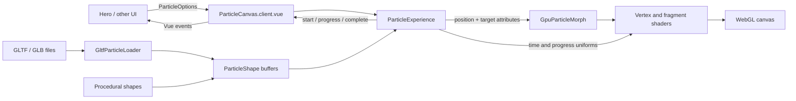

# Particle morph system

This document explains how the particle canvas turns procedural shapes or GLTF mesh vertices into a GPU-driven morph animation, and how Vue components can stay synchronized with that animation.

## Overview

The system keeps one fixed number of particles alive for the lifetime of a Three.js scene. Each shape is represented by a `Float32Array` of XYZ positions with exactly three values per particle and can optionally provide one brightness value per particle. A morph uploads the next shape as target attributes and lets the vertex shader interpolate every particle from its current position and brightness to its target values.

The CPU does not recalculate every particle every animation frame. During a normal morph it only advances the timer, updates a few shader uniforms, emits progress events, and asks Three.js to render. The per-particle interpolation, easing, travel arc, perspective sizing, and point placement happen on the GPU.



## Main modules

### `ParticleCanvas.client.vue`

`ParticleCanvas` is the Vue boundary. It:

- accepts the centralized `ParticleOptionsInput` object and an optional
  `openingShape` matching its particle count;
- creates and disposes the Three.js experience with the component lifecycle;
- displays `openingShape` before the first render, then prepends it to any GLTF
  sequence loaded in the background;
- watches nested option changes;
- reloads model shapes when model URLs or normalization options change;
- rebuilds the experience when a WebGL-context setting or the particle count changes;
- forwards morph lifecycle callbacks as Vue events.

The component deliberately contains no scene, geometry, or shader behavior.

### `ParticleExperience`

`ParticleExperience` coordinates the Three.js scene. It owns:

- the renderer, camera, timer, scene, and resize observer;
- the active particle configuration;
- the current list of shapes;
- GLTF loading;
- automatic shape sequencing;
- the render loop and morph event callbacks.

It is also the imperative API for consumers that do not want autoplay. Calling `morphTo(shape, duration)` begins a transition to any compatible `ParticleShape`.

### `GltfParticleLoader`

The GLTF loader converts a model scene into a particle shape in five stages:

1. Load the file with Three.js `GLTFLoader`.
2. Traverse every triangle `Mesh`, apply its world matrix, and measure triangle and mesh surface areas.
3. Give every mesh a fixed particle floor, then distribute the remaining budget using square-root surface-area weighting. This deliberately gives small components more representation than linear area weighting.
4. Give each non-degenerate triangle at least one particle when the budget permits, distribute the remainder with the same square-root area bias, and sample interiors with deterministic barycentric coordinates.
5. Optionally center the combined bounds and scale the longest side to `options.model.size`.

Meshes can set numeric `userData.particleBrightness` metadata. The sampler copies
that value to every particle allocated to the mesh, defaulting to `1`. This lets a
derived GLB emphasize semantic regions, such as continents, without coupling the
generic loader to a particular model.

Meshes can also set numeric `userData.particleDensity` metadata, defaulting to
`1`. It scales that mesh's square-root area weight during particle allocation.
This can make a semantic surface more legible without duplicating geometry and
reintroducing overlap hotspots.

The current per-mesh floor is 128 particles when the total budget permits it, with a second one-particle floor per triangle. Together these protect small but recognizable parts such as DNA rungs, microscope controls, and the globe stand. Square-root area weighting provides an additional non-linear bias toward small surfaces while still allowing large surfaces to receive most of the remaining particles.

Surface samples are deterministic across reloads and occupy triangle interiors instead of repeating the original low-poly vertices. The loader still reads static position buffers; skeletal deformation and morph-target deformation are not baked into the resulting shape.

### `GpuParticleMorph`

`GpuParticleMorph` owns one `THREE.Points`, its `BufferGeometry`, and its `ShaderMaterial`.

The geometry has five important attributes:

| Attribute | Contents | Updated when |
| --- | --- | --- |
| `position` | Current/source XYZ for every particle | A morph completes or is interrupted |
| `aTargetPosition` | Destination XYZ for every particle | A morph begins |
| `aRandom` | Stable pseudo-random value per particle | Only during construction |
| `aBrightness` | Current light intensity for every particle | A morph completes or is interrupted |
| `aTargetBrightness` | Destination light intensity | A morph begins |

The shader material receives these public-facing uniforms:

| Uniform | Purpose |
| --- | --- |
| `uProgress` | Linear transition progress from 0 to 1 |
| `uTime` | Elapsed scene time used for motion variation |
| `uPointSize` | Configured base point size |
| `uPixelRatio` | Capped device pixel ratio |
| `uColor` | Particle color |
| `uDriftStrength` | Amount of travel deviation during a morph |

## What happens during a morph

When a new shape is requested:

1. The system verifies that its position array matches the active particle count.
2. If another transition is already running, the visible intermediate positions are baked into the source buffer so the new transition does not snap.
3. The new shape is copied into `aTargetPosition` once and uploaded to the GPU.
4. `uProgress` resets to zero and `morph-start` is emitted.
5. Each animation frame advances linear progress according to the requested duration.
6. The vertex shader applies cubic ease-in-out and interpolates `position` toward `aTargetPosition` independently for every vertex.
7. A sine-shaped travel arc is strongest around the middle of the transition and zero at both endpoints. Stable per-particle random values vary the direction and distance.
8. The fragment shader turns each square WebGL point into a soft circular point
   and gives it a stable dark-to-light tint. A view-relative depth term shades
   near particles slightly brighter than far particles. Depth writing rejects most hidden
   surfaces, while maximum-contribution blending bounds intersections to the
   strongest individual particle instead of summing them into bright seams.
9. At progress 1, the target buffer is baked into the source buffer and `morph-complete` is emitted.

The interruption bake is the exceptional CPU-side per-particle operation. It runs only when a transition is interrupted or completed, not on normal animation frames. Its easing and drift calculation mirrors the vertex shader so the visible state remains continuous.

## Shape contract

Every morph target implements:

```ts
interface ParticleShape {
  name: string
  positions: Float32Array
  brightness?: Float32Array
}
```

For a particle count of `24_000`, `positions.length` must be `72_000`. Particle `i` occupies indices `i * 3`, `i * 3 + 1`, and `i * 3 + 2`.
When supplied, `brightness.length` must be `24_000`; omitted brightness defaults to `1`.

The default no-asset demo creates sphere, torus, and wave buffers in `createShapes.ts`. GLTF shapes and custom generated shapes use the same contract, so the renderer does not need to know where a shape came from.

## Timing and UI synchronization

`ParticleCanvas` emits three events:

- `morph-start` once when a transition begins;
- `morph-progress` at the start and on every animation frame;
- `morph-complete` once after the final progress event.

Each event contains:

```ts
interface MorphEvent {
  from: string
  to: string
  progress: number
  easedProgress: number
  elapsed: number
  duration: number
}
```

Use `progress` for timers, numeric readouts, or work that should advance at a constant rate. Use `easedProgress` when a UI element should visually track the particle interpolation exactly.

The hero consumes `morph-progress` to drive its bottom-right transition readout.
It maps internal shape names to display labels, shows the current source and
destination, and scales the progress rule with `easedProgress` so it follows the
visible particle motion. The same event selects the destination stage's headline.
`HeroHeader` deletes the previous word, types the new word, and keeps a blinking
cursor visible during the hold without maintaining a separate sequence timer.

```vue
<script setup lang="ts">
import { computed, reactive, ref } from 'vue'
import { defineParticleOptions } from '../three/particleOptions'
import type { MorphEvent } from '../three/types'

const options = reactive(defineParticleOptions({
  morphDuration: 2.4,
  holdDuration: 1,
}))

const morph = ref<MorphEvent>()
const synchronizedStyle = computed(() => ({
  opacity: morph.value?.easedProgress ?? 0,
}))
</script>

<template>
  <ParticleCanvas
    :options="options"
    @morph-progress="morph = $event"
  />
  <div :style="synchronizedStyle">Synchronized content</div>
</template>
```

With autoplay enabled, the experience waits for `morphDuration + holdDuration` from the start of one transition before starting the next. A duration change affects subsequent morphs; an already-running event continues to report the duration with which it began.

## Centralized configuration

All application-level parameters originate in `particleOptions.ts`. `defineParticleOptions()` merges partial overrides with the defaults, including nested camera, renderer, and model settings.

The public options cover:

- particle count and model URLs;
- autoplay, morph duration, and hold duration;
- point size, particle color, background color/alpha, drift, and rotation;
- camera field of view, clipping planes, and distance;
- renderer alpha, antialiasing, pixel-ratio cap, and power preference;
- model centering and normalized model size.

Most option changes are applied to the running scene. Changing `particleCount`, renderer alpha, antialiasing, or power preference requires a new geometry or WebGL context, so `ParticleCanvas` disposes and rebuilds the experience automatically. Changing model URLs or model normalization reloads the shape buffers.

The numeric constants that remain inside the shaders and procedural generators describe the implementation of a specific noise field, easing curve, point falloff, or shape formula. They are intentionally not application configuration.

## Performance characteristics

- Per-frame morph work scales on the GPU with the particle count.
- Starting a morph uploads one target position buffer: `particleCount * 3 * 4` bytes. At 24,000 particles this is approximately 281 KiB.
- The source, target, and random attributes remain allocated and are reused between transitions.
- Device pixel ratio is capped by `renderer.maxPixelRatio` to avoid excessive fill cost on high-density displays.
- Points use maximum-contribution blending and write depth, so overlapping mesh
  surfaces cannot add their brightness together. Large point sizes or very high
  particle counts can still become fill-rate limited.
- GLTF surface measurement and sampling currently happen on the main thread when a model loads.

## Lifecycle and cleanup

Vue creates the experience after the canvas mounts. `ResizeObserver` keeps renderer size, pixel ratio, and camera aspect current. On unmount or a structural option rebuild, the animation frame is canceled, observers and timers are disconnected, GPU geometry/materials are disposed, and the renderer is disposed.

This cleanup is important during route changes and hot reloads; without it, old WebGL contexts and animation loops would continue consuming resources.

## Common extension points

- Add `DRACOLoader` or `KTX2Loader` configuration inside `GltfParticleLoader` for compressed assets.
- Move surface collection and sampling into a worker if large models cause main-thread stalls.
- Add source/target color and point-size attributes for per-shape visual morphs.
- Add more easing functions to both the CPU event calculation and vertex shader together.
- Drive `morphTo()` from scroll, navigation, pointer state, or an application state machine with autoplay disabled.

When extending the morph formula, keep the GPU calculation and the interruption bake mathematically equivalent. If they diverge, interrupting an active transition will produce a visible jump.
